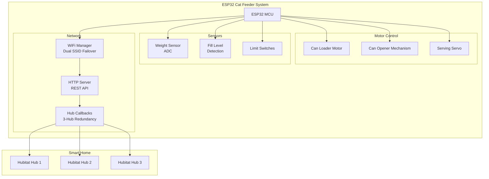
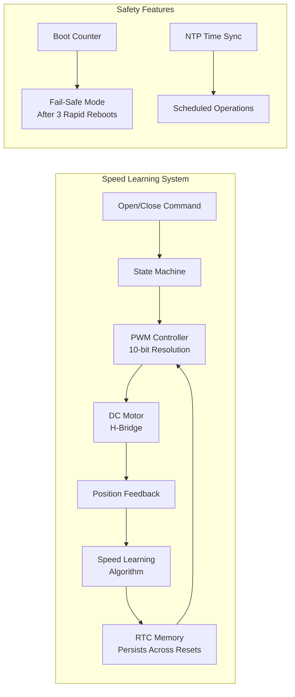
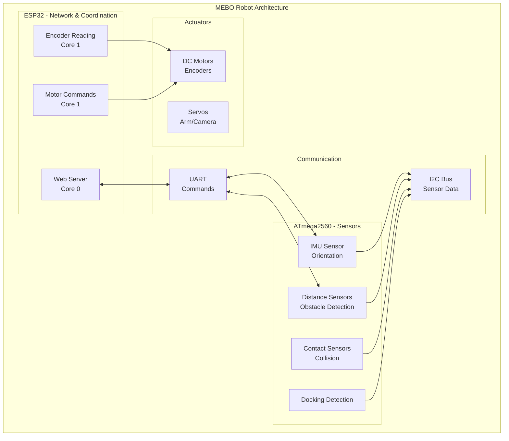
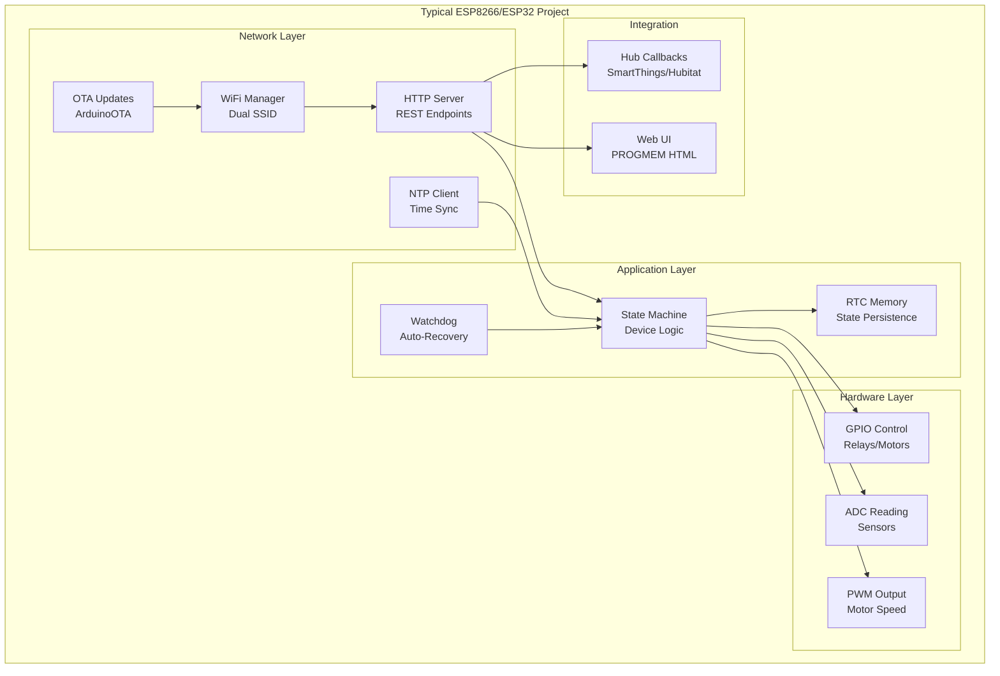

# Personal Projects - Smart Home Automation


Personal hobby projects built between 2018-2022, before formal software engineering training. These self-taught embedded systems experiments evolved into a fully automated smart home - demonstrating the curiosity and persistence that later led to a professional software engineering career.

**What these projects represent:**

- Self-directed learning in embedded C++, motor control, and networking
- Real problem-solving: devices that ran 24/7 for years in a production home environment
- Iterative improvement: multiple versions show evolution of understanding
- Foundation for later professional work in IoT and automation

**Full-stack integration:** See [HUBITAT_SMART_HOME](https://github.com/elfege/HUBITAT_SMART_HOME) for the Groovy drivers and automation rules that orchestrate these devices.

---

## Table of Contents

- [Flagship Projects](#flagship-projects)
  - [Automated Cat Feeder](#automated-cat-feeder-esp32_cat_feeder_3)
  - [Adaptive Window Controller](#adaptive-window-controller-esp8266_window_living)
  - [Multi-MCU Robot Platform](#multi-mcu-robot-platform-mebo)
- [Technical Challenges](#technical-challenges)
- [Other Projects](#other-projects)
- [Architecture Patterns](#architecture-patterns)

---

## Flagship Projects

### Automated Cat Feeder (ESP32_CAT_FEEDER_3)

**Problem:** Automate fresh cat food delivery on schedule while integrating with whole-home automation.

**Solution:** ESP32-based system that loads, opens, and serves canned cat food with sensor feedback.



**Key Features:**
- Can loading and opening mechanism with motor feedback
- Weight and fill level monitoring for jam detection
- 3-hub failover for reliability (if primary hub fails, device reports to backup)
- Web UI for manual override and diagnostics
- Watchdog timer with 4-hour auto-reset for stability

**Technologies:** ESP32, PWM motor control, ADC sensor reading, HTTP server, AJAX web UI

---

### Adaptive Window Controller (ESP8266_WINDOW_LIVING)

**Problem:** Motorized windows need different speeds for different conditions (temperature, resistance) and must remember optimal settings across power cycles.

**Solution:** Self-learning motor controller that adapts speed profiles and persists them in RTC memory.



**Key Features:**
- **Adaptive speed learning:** Adjusts motor timing based on observed performance
- **RTC memory persistence:** Learned speeds survive soft resets (not full power loss)
- **Fail-safe boot detection:** After 3 rapid reboots, enters safe mode to prevent boot loops
- **Multiple motor variants:** Stepper, PWM with H-bridge, linear actuator versions

**Technical Challenge - Speed Learning:**
```
Initial calibration: Run motor at known speed, measure time to fully open/close
Runtime adaptation: If motor stalls or overshoots, adjust speed profile
Persistence: Store learned values in RTC memory (survives ESP.restart())
Recovery: Fall back to defaults if RTC data is corrupted
```

**Technologies:** ESP8266, PWM, H-bridge motor control, RTC memory, NTP, state machines

---

### Multi-MCU Robot Platform (MEBO)

**Problem:** Complex robot requiring real-time motor control AND web connectivity - single MCU can't handle both reliably.

**Solution:** Distributed architecture with dedicated MCUs for sensors, motors, and network.



**Key Features:**
- **Dual-core ESP32:** Web server on Core 0, real-time motor/encoder on Core 1
- **ATmega2560 sensor hub:** Dedicated processor for sensor polling and filtering
- **Multiple communication protocols:** I2C for sensors, UART for inter-MCU commands
- **Self-drive autonomy:** Obstacle avoidance and docking station detection
- **Archived variants:** Project includes evolution from single-MCU to distributed architecture

**Technologies:** ESP32, ATmega2560, I2C, UART, dual-core programming, encoder feedback control

---

## Technical Challenges

### IR Protocol Memory Management (AC Controllers - Deprecated)

**Challenge:** Samsung AC IR codes are 199 bytes each. With 20+ temperature/mode combinations, SRAM quickly exhausts on ESP8266 (80KB total, ~50KB usable).

**Solution:**
- Store IR codes in PROGMEM (flash memory)
- Load single code to SRAM buffer only when transmitting
- RTC memory for state persistence (4 bytes vs re-storing full code)

**Outcome:** Successfully controlled AC units for 3+ years. Now deprecated - modern Midea units support direct cloud API control via [Hubitat Groovy drivers](https://github.com/elfege/HUBITAT_SMART_HOME), eliminating embedded IR complexity entirely.

### Multi-Hub Failover

**Challenge:** Smart home hubs occasionally go offline. Devices shouldn't become uncontrollable.

**Solution:** Dual SSID support with 3-hub callback system:
```
Primary Hub (192.168.1.x) -> Backup Hub 1 (192.168.2.x) -> Backup Hub 2 (192.168.3.x)
```
Device attempts callback to each hub in sequence until successful.

### Boot Loop Prevention

**Challenge:** Configuration errors or hardware issues can cause infinite reboot loops.

**Solution:** Boot counter in RTC memory:
- Increment counter on boot
- If counter > 3 within 60 seconds, enter fail-safe mode
- Fail-safe mode: disable problematic features, enable web UI for diagnostics
- Clear counter after 60 seconds of stable operation

---

## Other Projects

### Pet Care
| Project | MCU | Description |
|---------|-----|-------------|
| ESP32_DRY_FOOD_CATFEEDER | ESP32 | Dry food dispenser with weight monitoring |
| CATGENIE_RESET | ATmega | I2C EEPROM reset for litter box cartridges |

### Window/Curtain Automation
| Project | MCU | Description |
|---------|-----|-------------|
| ESP8266_WINDOW_BEDROOM_* | ESP8266 | Multiple variants: stepper, PWM, H-bridge |
| ESP8266_WINDOW_OFFICE_* | ESP8266 | Linear actuator and PWM variants |
| ESP8266_WINDOW_MINERVA | ESP8266 | Guest room window controller |
| ESP8266_CURTAINS_BEDROOM | ESP8266 | Motorized curtain control |
| ESP8266_CURTAINS_LIVING | ESP8266 | Living room curtain automation |

### Sensors & Utilities
| Project | MCU | Description |
|---------|-----|-------------|
| ESP8266_BED_SENSOR | ESP8266 | Bed occupancy detection |
| ESP8266_MOTION_SENSOR | ESP8266 | PIR sensor with SmartThings integration |
| ESP8266_DOOR_INTERCOM_BELL | ESP8266 | Auto door unlock on intercom ring |
| ESP8266_WaterTankPurge | ESP8266 | Scheduled water tank maintenance |
| IR_TV | ESP8266 | IR remote control for TV |

### Robotics
| Project | MCU | Description |
|---------|-----|-------------|
| ESP32_KOBRA_2020 | ESP32 | Mobile rover with dual-core motor control |
| ESP8266_KOBRA_2.0_JS | ESP8266 | Rover power controller |

### Deprecated
| Project | MCU | Status |
|---------|-----|--------|
| ESP8266_AC_BEDROOM_* | ESP8266 | Replaced by Hubitat Groovy drivers |

---

## Architecture Patterns

### Common Design Across All Projects



### File Structure Convention

Projects use multi-file `.ino` structure with alphabetical prefixes for compilation order:

```
ProjectName/
├── ProjectName.ino          # Main file (entry point)
├── A_Types.h                # Enums, structs, type definitions
├── A_PINS_Const_Vars.ino    # Pin definitions, constants, globals
├── B_WiFi.ino               # WiFi configuration and connection
├── C_XML.ino                # HTTP endpoint handlers
├── D_Setup.ino              # setup() function
├── E_Loop.ino               # loop() function
├── X_Functions.ino          # Helper functions
├── index.h                  # Web UI (PROGMEM HTML)
└── secrets.h                # WiFi credentials (gitignored)
```

### Credentials Pattern

All projects use `secrets.h` for WiFi credentials (excluded from git):

```cpp
#define WIFI_SSID "your_ssid"
#define WIFI_PASSWORD "your_password"
```

---

## Author

**Elfege Leylavergne**
- Website: [elfege.com](https://elfege.com)
- GitHub: [github.com/elfege](https://github.com/elfege)
- LinkedIn: [linkedin.com/in/elfege](https://www.linkedin.com/in/elfege/)
